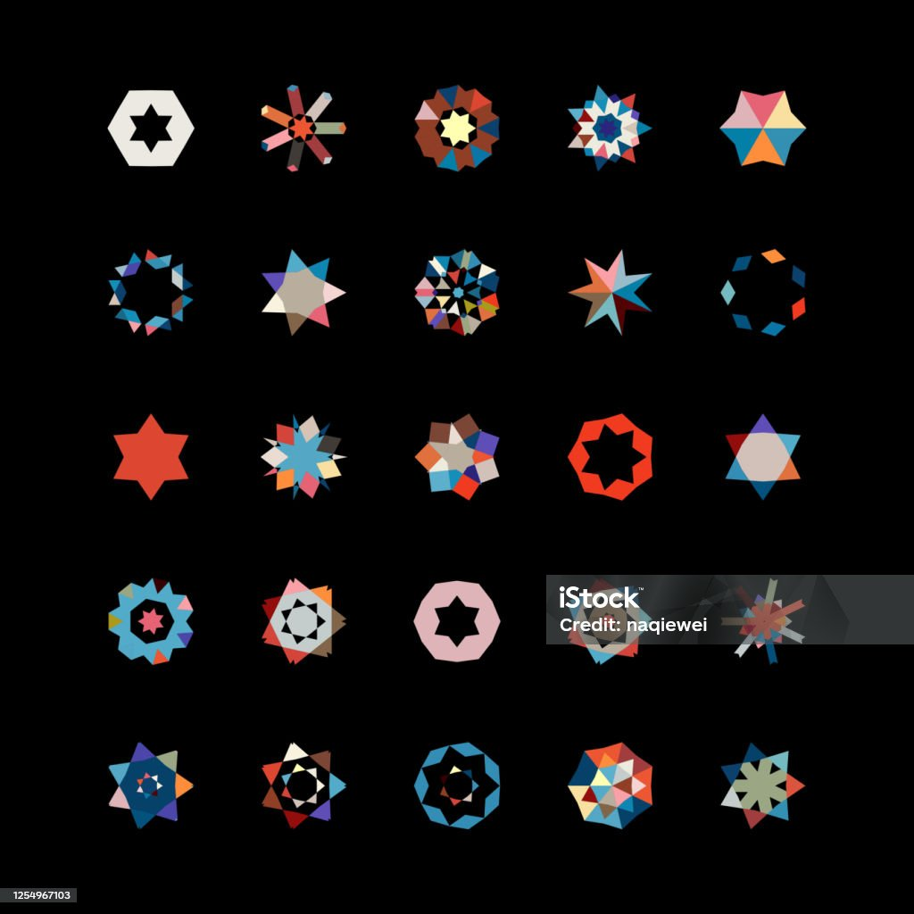

# Creative coding major project

Based on: Wheels of Fortune, Pacita Abad, 2000

### **User Input:** Incorporate keyboard inputs for animation.

I chose to change the artwork based on keyboard input to make it animated. When the user presses the left or right arrow keys on the keyboard, the inside of wealth wheels changes. 

### **←**

If you press the left arrow key, the star-like shape in wealth wheels is reduced, indicating a decrease in wealth. 

### **→**

Vice versa, when you press the right arrow key, the star-like shape of the wealth wheel increases, symbolising that the wealth wheels have accumulated more wealth. 

### **%**

When the wealth is reduced to the minimum, the screen will randomly appear empty area, symbolising that the wealth is completely consumed by other wealth wheels.

### Inspiration - Kaleidoscope

Our artwork and animations are influenced by the concept of a kaleidoscope. Based on the original artwork created by Pacita, we restored the polka dots and star-shaped textures. Based on the Angle of rotation of the kaleidoscope, the user can see different polygons.

Picture source: Vector floral pattern, naqiewei, iStock

### Conclusion

I created a keyPressed( ) function to change the vertexOffset variable, which will affect on the number of vertices of star-like shape. Through press left and right arrow key, the vertexOffset variable will change, to increase or decrease the vertices amount.